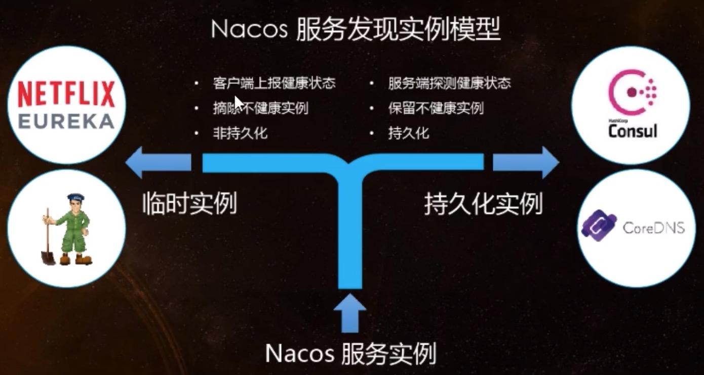

## 定义
一个更易于构建云原生应用的动态服务发现、配置管理和服务管理平台。

## 功能

* 动态配置服务
动态配置服务让您能够以中心化、外部化和动态化的方式管理所有环境的配置。动态配置消除了配置变更时重新部署应用和服务的需要。配置中心化管理让实现无状态服务更简单，也让按需弹性扩展服务更容易。

* 服务发现及管理
动态服务发现对以服务为中心的（例如微服务和云原生）应用架构方式非常关键。Nacos支持DNS-Based和RPC-Based（Dubbo、gRPC）模式的服务发现。Nacos也提供实时健康检查，以防止将请求发往不健康的主机或服务实例。借助Nacos，您可以更容易地为您的服务实现断路器。

* 动态DNS服务
通过支持权重路由，动态DNS服务能让您轻松实现中间层负载均衡、更灵活的路由策略、流量控制以及简单数据中心内网的简单DNS解析服务。动态DNS服务还能让您更容易地实现以DNS协议为基础的服务发现，以消除耦合到厂商私有服务发现API上的风险。

Nacos既支持AP，也支持CP。
C是所有节点在同一时间看到的数据是一致的；而A的定义是所有的请求都会收到响应。

## 何时选择使用何种模式？

如果不需要存储服务级别的信息且服务实例是通过nacos-client注册，并能够保持心跳上报，那么就可以选择AP模式。当前主流的服务如Spring cloud和Dubbo服务，都适用于AP模式。
AP模式为了服务的可能性而减弱了一致性，因此AP模式下支持注册临时实例。

如果需要在服务级别编辑或者存储配置信息，那么CP是必须的，K8S服务和DNS服务则适用于CP模式。
CP模式下则支持注册持久化实例，此时则是以Raft协议为集群运行模式，该模式下注册实例之前必须先注册服务，如果服务不存在，则会返回错误。

切换模式：
curl -X PUT '$NACOS_SERVER:8848/nacos/v1/ns/operator/switches?entity=serverMode&value=CP'

