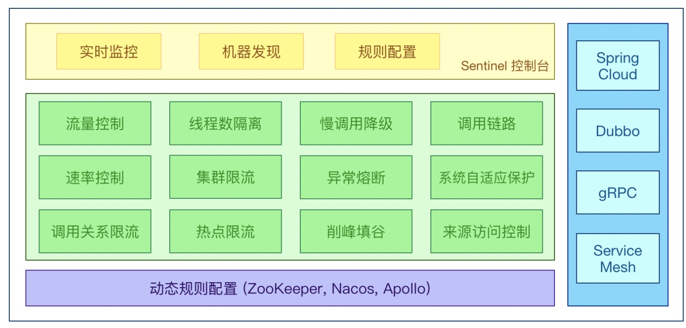

## 0.spring cloud 使用的基础架构

* 1.服务注册中心
  Eureka，Zookeeper，Consul，Nacos(推荐)

* 2.服务调用
  Ribbon，LoadBalancer
  Feign，OpenFeign(推荐)

* 3.服务降级
  Hystrix，resilience4j(国外使用多)，Sentinel(国内使用多)

* 4.服务网关

  Zuul，Zuul2(胎死腹中)，Gateway(推荐)

* 5.服务配置

  Config，Nacos(推荐)

* 6.服务主线

  Bus，Nacos(推荐)

* 7.事务 

   Seata

## 1.服务注册中心

### 1.1 Eureka

服务治理组件，管理服务之间依赖关系，可以实现服务调用、负载均衡、容错等功能，实现服务发现与注册。


Eureka采用的是CS的设计架构，分为两部分：

* Eureka Server作为服务注册功能的服务器，是服务注册中心。
* Eureka Client，java客户端，用于简化Eureka Server的交互，客户端同时也具有一个内置的、使用轮询（round-robin）负载算法的负载均衡器。在应用启动后，将会向Eureka Server发送心跳（默认30s），如果Eureka Server多个心跳周期内没有接收到某个节点的心跳，EurekaServer将会从服务注册中把这个节点移除（默认90s）。


Eureka 的设计原则是 AP，即可用性和分区容错性。他保证了注册中心的可用性，但舍弃了数据一致性，**各节点上的数据有可能是不一致的（会最终一致）**。

[实现原理](<https://www.infoq.cn/article/jlDJQ*3wtN2PcqTDyokh>)

[wiki](<https://github.com/Netflix/eureka/wiki>)

具体配置参见：[eureka](<https://github.com/tulingfeng/cloud2020/blob/master/doc/eureka_deploy.md>)


### 1.2 Zookeeper

`Zookeeper`是一个分布式协调工具，可以实现注册中心功能。**临时节点**。

具体配置参见：[zookeeper](<https://github.com/tulingfeng/cloud2020/blob/master/doc/zookeeper_deploy.md>)


### 1.3 Consul

```text
Consul is a service mesh solution providing a full featured control plane with service discovery, configuration, and segmentation functionality. 
```

[官网](<https://www.consul.io/intro/index.html>)

作用:

* 1.服务发现：提供HTTP/DNS两种发现方式
* 2.健康监测
* 3.KV存储
* 4.多数据中心
* 5.可视化界面

具体配置参考：[consul](<https://github.com/tulingfeng/cloud2020/blob/master/doc/consul.md>)


### 1.4 Eureka、Zookeeper、Consul的异同点

根据`CAP`理论：

```text
C：Consistency(强一致性)
A：Availability(可用性)
P：Partition tolerance(分区容错性)

CAP理论关注粒度是否是数据，而不是整体系统设计的策略
```


```text
Eureka: AP
有自我保护机制，不删除注册中心中的微服务，当网络分区出现后，为了保证可用性，系统B可以返回旧值，保证系统的可用性。

Zookeeper/Consul: CP
当网络分区出现后，为了保证一致性，就必须拒绝请求，否则无法保证一致性。
```

[参考](<https://blog.csdn.net/qq_41211642/article/details/104836741>)


## 2.服务调用

### 2.1 Ribbon

主要提供客户端软件负载均衡算法和服务调用。

**负载均衡**

简单的说就是将用户的请求平摊的分配到多个服务上，从而达到系统的HA（高可用）。
常见的负载均衡有软件 Nginx，LVS，硬件F5 等。

- 集中式LB
  即在服务的消费方和提供方之间使用独立的LB设施（可以是硬件，如F5，也可以是软件，如nginx）,由该设施负责把访问请求通过某种策略转发至服务的提供方
- 进程内LB
  将 LB 逻辑集成到消费方，消费方从服务注册中心获知有哪些地址可用，然后自己再从这些地址中选择出一个合适的服务器。
  Ribbon就属于进程内 LB ，它只是一个类库，集成与消费方进程，消费方通过它来获取到服务提供方的地址。


**Ribbon本地负载均衡客户端和Ngnix服务端负载均衡区别：**

Nginx 是服务器负载均衡，客户端所有请求都会交给 nginx ，然后由 nginx 实现转发请求。即负载均衡是由服务端实现的。

Ribbon 本地负载均衡，在调用微服务接口时候，会在注册中心上获取注册信息服务列表之后缓存到JVM本地，从而在本地实现 RPC 远程服务调用技术。

Ribbon 就是负载均衡+RestTemplate调用 最终实现RPC的远程调用。


`EurekaClient`底层用的也是`netfix-ribbon`的jar包。

`Ribbon`中的负载均衡算法如下：


可以自己定义相关负载均衡算法，需要在主启动类中加上相关注解`@RibbonClient(name="xxx",configuration=MySelfRule.class)`


**负载均衡算法原理**：

rest接口第几次请求数 % 服务器集群总数量 = 实际调用服务器位置下标

其中服务器集群总数量由

```java
List<Serviceinstance> instances = discoveryClient.getInstances("CLOUD-PAYMENT-SERVICE");
```

获取。


### 2.2 OpenFeign

Feign是一个声明式的Web服务客户端，只需创建一个接口并在接口上添加注解即可。

具体配置参考：


**Feign自带负载均衡项**

注意`OpenFeign`默认等地啊1秒钟，超过后报错。因此可以在客户端进行超时配置：

```xml
ribbon:
  
  #  指的是建立连接所用的时间 , 适用于网络状态正常的情况下 , 两端连接所用的时间

   ReadTimeout: 5000
  
  #  指的是建立连接后从服务器读取到可用资源所用的时间
  
   ConnectTimeout: 5000 
```


## 3.服务降级

### 3.1 Hystrix

**Hystrix概念**

Hystrix是一个用于处理分布式系统的延迟和容错的开源库，在分布式系统里，许多依赖不可避免的会调用失败，比如超时、异常等，
Hystrix能够保证在一个依赖出问题的情况下，不会导致整体服务失败，避免级联故障，已提高分布式系统的弹性。

**Hystrix功能**

- 服务降级
  程序运行异常
  超时
  服务熔断触发服务降级
  线程池、信号量打满也会导致服务降级
- 服务熔断
  类似保险丝达到最大服务访问后，直接拒绝访问，拉闸限电，然后调用服务降级的方法并返回友好提示。
- 接近实时的监控
- 限流、隔离等
  秒杀高并发等操作，严禁一窝蜂的过来拥挤，大家排队，一秒钟N个，有序进行。


**微服务存在的服务雪崩**

扇出的概念。

多个微服务之间调用的时候，假设微服务A调用微服务B和微服务C，微服务B和微服务C又调用其他微服务，
这就是所谓的"扇出"。

如果扇出的链路上某个微服务的调用响应时间过长或不可用，对微服务A的调用就会占用越来越多的系统资源，
进而引起系统崩溃，所谓的"雪崩效应"。

通常当你发现一个模块下的某个实例失败后，这时候这个模块依然还会接受流量，然后这个有问题的模块还调用了其他
模块，这样就会发生级联故障，或者叫雪崩。


**降级容错解决的维度要求**

- 1.超时导致服务器变慢（转圈）
  超时不再等待
- 2.出错（宕机或程序运行出错）
  出错要有兜底
- 3.解决
  1）对方服务（8001）超时，调用者（80）不能一直卡死等待，必须有服务降级
  2）对方服务（8001）宕机，调用者（80）不能一直卡死等待，必须有服务降级
  3）对方服务（8001）OK，调用者（80）自己出故障或自我要求（自己的等待时间小于服务提供者），自己处理降级。


**熔断类型**：


- 关闭

- - 熔断器在默认情况下下是呈现关闭的状态，而熔断器本身带有计数功能，每当错误发生一次，计数器也就会进行“累加”的动作，到了一定的错误发生次数断路器就会被“开启”，这个时候亦会在内部启用一个计时器，一旦时间到了就会切换成半开启的状态。

- 开启

- - 在开启的状态下任何请求都会“直接”被拒绝并且抛出异常讯息。

- 半开启

- - 在此状态下断路器会允许部分的请求，如果这些请求都能成功通过，那么就意味着错误已经不存在，则会被切换回关闭状态并重置计数。倘若请求中有“任一”的错误发生，则会回复到“开启”状态，并且重新计时，给予系统一段休息时间。


**Hystrix 服务熔断**

在SpringCloud框架里，熔断机制通过Hystrix实现，Hystrix会监控微服务间调用的状况，当失败的调用到一定阈值，缺省是5秒内20次调用失败，就会启动熔断机制。

熔断机制的注解是`@HystrixCommand`

设计到断路器的三个重要参数：快照时间窗、请求总数阈值、错误百分比阈值

1.快照时间窗：断路器确定是否打开需要统计一些请求和错误数据，而统计的时间范围就是快照时间窗，默认为最近的10秒

2.请求总数阈值：在快照时间内，必须满足请求总数阈值才有资格熔断。默认为20，意味着在10秒内，如果该hystrix命令的调用次数不足20次，即使所有的请求都超时或其他原因失败，断路器都不会打开

3.错误百分比阈值：当请求总数在快照时间窗内超过阈值，比如发生了30次调用，如果在这30次调用中，有15次发生了超时异常，也就是超过50%的错误百分比，在默认设定50%阈值情况下，这时候就会将断路器打开

```text
注解说明：
@HystrixCommand(fallbackMethod = "paymentCircuitBreaker_fallback",commandProperties ={
        @HystrixProperty(name = "circuitBreaker.enabled",value = "true"), //是否开启断路器
        @HystrixProperty(name = "circuitBreaker.requestVolumeThreshold",value = "10"), //请求次数
        @HystrixProperty(name = "circuitBreaker.sleepWindowInMilliseconds",value = "10000"), //时间窗口期
        @HystrixProperty(name = "circuitBreaker.errorThresholdPercentage",value = "60"),//失败率达到多少后跳闸
})
```

熔断器需要具备的特征：

**快速失败、无缝恢复**


**Hystrix工作流程**


**步骤**：

```text
1.定义HystrixCommand、HystrixObservableCommand对象
2.执行Command
3.判断是否存在Response Cached，如果存在，直接返回Cache，否则执行下一步
4.判断circuit-breaker是否打开，如果打开获取Fallback方法，否则执行下一步
5.判断线程池、队列、信号量等是否已满，如果满了也会去获取Fallback方法，否则执行下一步
6.执行HystrixCommand.run()方法或HystrixObservableCommand.construct()方法
如果执行失败或超时也会去获取FallBack方法，执行成功的话会返回成正常的结果
7.在运行过程中会去Calculate circuit health
8.上述失败的情形都会汇总到获取FallBack方法，如果FallBack方法执行成功，返回fallback内容，否则失败。
```


### 3.2 Sentinel

#### 3.2.1 简单介绍

分布式系统的流量防卫兵，跟Hystrix类似。

[参考](https://github.com/alibaba/Sentinel/wiki/%E4%BB%8B%E7%BB%8D)

**特征**

- 丰富的应用场景：Sentinel 承接了阿里巴巴近 10 年的双十一大促流量的核心场景，例如秒杀（即突发流量控制在系统容量可以承受的范围）、消息削峰填谷、集群流量控制、实时熔断下游不可用应用等。
- 完备的实时监控：Sentinel 同时提供实时的监控功能。您可以在控制台中看到接入应用的单台机器秒级数据，甚至 500 台以下规模的集群的汇总运行情况。
- 广泛的开源生态：Sentinel 提供开箱即用的与其它开源框架/库的整合模块，例如与 Spring Cloud、Dubbo、gRPC 的整合。您只需要引入相应的依赖并进行简单的配置即可快速地接入 Sentinel。
- 完善的 SPI 扩展点：Sentinel 提供简单易用、完善的 SPI 扩展接口。您可以通过实现扩展接口来快速地定制逻辑。例如定制规则管理、适配动态数据源等。



**组成**

- 核心库（Java 客户端）不依赖任何框架/库，能够运行于所有 Java 运行时环境，同时对 Dubbo / Spring Cloud 等框架也有较好的支持。
  `sentinel-core`
- 控制台（Dashboard）基于 Spring Boot 开发，打包后可以直接运行，不需要额外的 Tomcat 等应用容器。
  `sentinel-dashboard`

sentinel是懒加载，只有数据进去dashboard才会展示。


#### 3.2.2 流控

1.预热
秒杀系统让流量预热，慢慢增加到设置的阈值

sentinel中设置：
 

默认coldFactor为3，即请求QPS从(threshold/3)开始，经多少预热时长才逐渐升至设定的QPS阈值。
例如：
阈值10+预热时长设置5s
系统初始化的阈值为10/3约等于3，即阈值刚开始为3，然后过了5秒后阈值才慢慢升高恢复到10。

2.排队
匀速排队：严格控制请求通过的间隔时间，也即是让请求以均匀的速度通过，对应的是漏桶算法。


这种方式主要用于处理间隔性突发的流量，例如消息队列。例如某一秒有大量的请求到来，
而接下来的几秒则处于空闲状态，我们希望系统能够在接下来的空闲时间逐渐处理这些请求而不是在第一秒直接拒绝多余的请求。


#### 3.2.3 降级

[熔断降级](https://github.com/alibaba/Sentinel/wiki/%E7%86%94%E6%96%AD%E9%99%8D%E7%BA%A7)

**热点参数限流**

Sentinel 利用 LRU 策略统计最近最常访问的热点参数，结合令牌桶算法来进行参数级别的流控。热点参数限流支持集群模式。

请求：`http://localhost:8401/testHotKey?p1=a`

代码：

```java
 @GetMapping("/testHotKey")
    @SentinelResource(value = "testHotKey", blockHandler = "dealTestHotKey") // dealTestHotKey是兜底方法
    public String testHotKey(@RequestParam(value = "p1", required = false) String p1,
                             @RequestParam(value = "p2", required = false) String p2){
//        int age = 10 /0;  
        return "testHotKey -----";
    }

    public String dealTestHotKey(String p1, String p2, BlockException blockException){
        return "dealTestHotKey---------";
    }
```


这样访问QPS为1，会有些请求访问dealTestHotKey方法。


#### 3.2.4 持久化

服务重启配置的sentinel流控就会消息，需要对其进行持久化。在nacos中配置：

```json
[
    {
        "resource":"/rateLimit/byUrl", # 资源名称
        "limitApp":"default", # 来源应用
        "grade":1, # 阈值类型，0表示线程数，1表示QPS
        "count":1, # 单机阈值
        "strategy":0, # 流控模式，0表示直接，1表示关联，2表示链路
        "controlBehavior":0, # 流控效果，0表示快速失败，1表示warmup，2表示排队等待
        "clusterMode":false # 是否集群
    }
]
```


具体配置参考：[sentinel](<https://github.com/tulingfeng/cloud2020/blob/master/doc/sentinel_deploy.md>)


### 3.3 Hystrix与Sentinel的区别


## 4.服务网关

###  4.1 Zuul

Zuul包含了对请求的**路由**和**过滤**两个最主要的功能： 

其中路由功能负责将外部请求转发到具体的微服务实例上，是实现外部访问统一入口的基础而过滤器功能则负责对请求的处理过程进行干预，是实现请求校验、服务聚合等功能的基础.Zuul和Eureka进行整合，将Zuul自身注册为Eureka服务治理下的应用，同时从Eureka中获得其他微服务的消息，也即以后的访问微服务都是通过Zuul跳转后获得。 

**Zuul服务需要注册进Eureka**

具体配置参考：[zuul](<https://github.com/tulingfeng/cloud2020/blob/master/doc/zuul_deploy.md>)


### 4.2 Gateway

网关(Gateway)又称网间连接器、协议转换器

网关(Gateway)就是一个网络连接到另一个网络的“关口”。

网关在传输层上以实现网络互连，是最复杂的网络互连设备，仅用于两个高层协议不同的网络互连。

网关实质上是一个网络通向其他网络的IP地址。

```text
比如有网络A和网络B，网络A的IP地址范围为“192.168.1.1~192.168.1.254”，子网掩码为255.255.255.0；网络B的IP地址范围为“192.168.2.1~192.168.2.254”，子网掩码为255.255.255.0。

在没有路由器的情况下，两个网络之间是不能进行TCP/IP通信的，即使是两个网络连接在同一台交换机(或集线器)上，TCP/IP协议也会根据子网掩码(255.255.255.0)判定两个网络中的主机处在不同的网络里。

如果网络A中的主机发现数据包的目的主机不在本地网络中，就把数据包转发给它自己的网关，再由网关转发给网络B的网关，网络B的网关再转发给网络B的某个主机。网络B向网络A转发数据包的过程。

对默认网关，其意思是一台主机如果找不到可用的网关，就把数据包发给默认指定的网关，由这个网关来处理数据包。现在主机使用的网关，一般指的是默认网关。所以说，只有设置好网关的IP地址，TCP/IP协议才能实现不同网络之间的相互通信。
```

#### 4.2.1 Spring Cloud Gateway

基于`Spring5.0+Spring Boot 2.0+Project Reactor`等技术开发的网关，它旨在为微服务架构提供一种简单有效的统一的API理由管路方式。

Spring Cloud Gateway使用的是Webflux中的reactor-netty响应式编程组件，底层使用了Netty通讯框架。

功能：

- 反向代理
- 鉴权
- 流量控制
- 熔断
- 日志监控

**微服务架构中网关的位置**


#### 4.2.2 为什么选择Gateway不选Zuul?

- netflix不太靠谱，zuul 2.0一直跳票，迟迟不发布
- SpringCloud Gateway具有如下特性
  基于Spring Framework 5，Project Reactor和Spring Boot 2.0构建
  动态路由：能够匹配任何请求属性
  可以对路由指定 Predicate（断言）和Filter（过滤器）
  集成Hystrix的断路器功能
  集成Spring Cloud 的服务发现功能
  易于编写的Predicate（断言）和Filter（过滤器）
  请求限流功能
  支持路径重写
- SpringCloud Gateway 与 zuul 的区别
  在SpringCloud Finchley 正式版之前，SpringCloud推荐的网关是Netflix提供的Zuul：
  1、Zuul 1.x是一个基于阻塞 I/O 的API Gateway
  2、Zuul 1.x基于servlet 2.5使用阻塞架构它不支持任何长连接（如websocket）Zuul的设计模式和Nginx较像，每次I/O 操作都是从工作线程中选择一个执行，请求线程被阻塞到工作线程完成，但是差别是Nginx用C++实现，Zuul用Java实现，而JVM本身会有一次加载较慢的情况，使得zuul的性能相对较差
  3、Zuul 2.x理念更先进，向基于Netty非阻塞和支持长连接，但SpringCloud目前还没有整合。Zuul 2.x的性能较Zuul 1.x有较大提升。在性能方面，根据官方提供的基准测试，SpringCloud Gateway的RPS（每秒请求数）是Zuul的1.6倍
  4、SpringCloud Gateway建立在Spring Framework5、Project Reactor和Spring Boot 2之上，使用非阻塞API
  5、SpringCloud Gateway还支持WebSocket，并且与Spring紧密集成用于更好的开发体验


#### 4.2.3 Zuul 1.x模型

SpringCloud中所集成的Zuul版本，采用的是Tomcat容器，使用的是传统的Servlet IO处理模型。

Servlet生命周期？
servlet 由 servlet container 进行生命周期管理
container 启动时构造 servlet 对象并调用 servlet init() 进行初始化；
container 运行时接受请求，并为每个请求分配一个线程（一般从线程池中获取空闲线程）然后调用service()；
container 关闭时调用 servlet destory() 销毁servlet。


**缺点**

servlet是一个简单的网络IO模型，当请求进入servlet container时，servlet container就会为其绑定一个线程，在并发不高的场景下这种模型是适用的。但是一旦高并发（比如用jmeter压测），线程数量就会涨，而线程资源代价是昂贵的（上下文切换，内存消耗大）严重影响请求的处理时间。在一些简单业务场景下，不希望为每个request分配一个线程，只需要1个或几个线程就能应对极大并发的请求，这种业务场景下servlet模型没有优势。


#### 4.2.4 Gateway 核心概念及工作流程

**核心概念**

- Route(路由)：路由是构建网关的基本模块，它由ID、目标URI，一系列的断言和过滤器组成，如果断言为true则匹配该路由。

- Predicate(断言)：参考的是Java8的java.util.function.Predicate
  开发人员可以匹配HTTP请求中的所有内容(例如请求头或请求参数)，如果请求与断言相匹配则进行路由

- Filter(过滤)：指的是Spring框架中GatewayFilyter的实例，使用过滤器，可以在请求被路由前或者之后进行修改。

**匹配方式就是断言，实现这个匹配方式叫过滤，对外表现出来的就是路由的功能**


**工作流程**


```text
1.客户端向Spring Cloud Gateway发出请求。然后在Gateway Handler Mapping中找到与请求相匹配的路由，将其发送到Gateway Web Handler。

2.Handler再通过指定的过滤器链来将请求发送到我们实际的服务执行业务逻辑，然后返回。
过滤器之间用虚线分开是因为过滤器可能会在发送代理请求之前（“pre”）或之后（“post”）执行业务逻辑。

3.Filter 在 “pre” 类型的过滤器可以做参数校验、权限校验、流量监控、日志输出、协议转换等；在 “post” 类型的过滤器中可以做响应内容、响应头的修改，日志的输出，流量监控等，有着非常重要的作用。
```

**核心逻辑**

路由转发+执行过滤器链。

具体配置参见：[gateway](<https://github.com/tulingfeng/cloud2020/blob/master/doc/gateway_deploy.md>)


## 5.服务配置及服务总线

### 5.1 Nacos

`Nacos`  `Nameing + Configuration + Service`

一个更易于构建原生应用的动态服务发现、配置管理和服务管理平台。

`Nacos` = `Eureka+Config+Bus`

功能：服务注册及管理、配置管理。

**Nacos既支持AP，也支持CP。**
C是所有节点在同一时间看到的数据是一致的；而A的定义是所有的请求都会收到响应。


**何时选择使用何种模式？**

如果不需要存储服务级别的信息且服务实例是通过nacos-client注册，并能够保持心跳上报，那么就可以选择AP模式。当前主流的服务如Spring cloud和Dubbo服务，都适用于AP模式。
AP模式为了服务的可能性而减弱了一致性，因此AP模式下支持注册临时实例。

如果需要在服务级别编辑或者存储配置信息，那么CP是必须的，K8S服务和DNS服务则适用于CP模式。
CP模式下则支持注册持久化实例，此时则是以Raft协议为集群运行模式，该模式下注册实例之前必须先注册服务，如果服务不存在，则会返回错误。

切换模式：
`curl -X PUT '$NACOS_SERVER:8848/nacos/v1/ns/operator/switches?entity=serverMode&value=CP'`


**Nacos与其他注册中心特性对比**


具体配置参见：[nacos](<https://github.com/tulingfeng/cloud2020/blob/master/doc/nacos_deploy.md>)


### 5.2 Bus

消息总线：微服务中使用轻量级的消息代理（支持RabbitMQ和Kafka）来构建一个共用的消息主题，并让系统中所有微服务实例都连接上来。由于该主题中产生的消息会被所有实例监听和消费，所以称为消息总线。

分布式自动刷新配置。

是用来将分布式系统的节点与轻量级消息系统链接起来的框架。

整合了Java的事件处理机制和消息中间件的功能。

**原理**：

`ConfigClient`实例都会监听MQ中同一个`topic`(默认是`SpringCloudBus`)。当一个服务刷新数据时，它会把这个信息放到`Topic`中，这样其他监听同一`Topic`的服务就会得到通知，然后去更新自身配置。


## 6.消息驱动

### 6.1 stream

**消息驱动**
屏蔽底层消息中间件的差异，降低切换成本，统一消息的编程模型。

**解决方案**
应用程序通过inputs 或者 outputs 来与SpringCloud Stream中**binder对象**交互。通过我们**配置来binding**（绑定），而SpringCloud Stream的binder对象负责与消息中间件交互。
所以，我们只需要搞清楚如何与SpringCloud Stream交互就可以方便使用消息驱动的方式。

通过使用Spring Integration来连接消息代理中间件以实现消息时间驱动
SpringCloud Stream 为一些供应商的消息中间件产品提供了个性化的自动化配置实现，引用了发布-订阅、消费组、分区的三个核心概念。

**Stream标准流程套路**


Binder：很方便的连接中间件，屏蔽差异
Channel：通道，是队列Queue的一种抽象，在消息通讯系统中就是实现存储和转发的媒介，通过Channel对队列进行配置
Source和Sink：简单的可以理解为参照对象是SpringCloud Stream自身，从Stream发布消息就是输出，接收消息就是输入

**编码API和常用注解**


具体配置参见：[stream](<https://github.com/tulingfeng/cloud2020/blob/master/doc/Stream.md>)


## 7.分布式事务

### 7.1 Seata

[分布式事务](https://juejin.im/post/5b5a0bf9f265da0f6523913b)

**Seata 要点：**
1 ID + 3组件模型

```text
Transaction ID XID 全局唯一的事务ID
Transaction Coordinator 事务协调器:维护全局和分支事务的状态，驱动全局事务提交或回滚。
Transaction Manager 事务管理器:定义全局事务的范围：开始全局事务、提交或回滚全局事务。
Resource Manager 资源管理器：管理分支事务处理的资源，与TC交谈以注册分支事务和报告分支事务的状态，并驱动分支事务提交或回滚。
```


**执行流程**

- 1.TM 开启分布式事务（TM 向 TC 注册全局事务记录）
- 2.按业务场景，编排数据库、服务等事务内资源（RM 向 TC 汇报资源准备状态 ）
- 3.TM 结束分布式事务，事务一阶段结束（TM 通知 TC 提交/回滚分布式事务）
- 4.TC 汇总事务信息，决定分布式事务是提交还是回滚
- TC 通知所有 RM 提交/回滚 资源，事务二阶段结束


**AT模式介绍**

1.一阶段加载


- 1.解析SQL语义，找到"业务SQL"要更新的数据源，在其业务数据更新之前，将其保存成"before image"；
- 2.执行"业务SQL"，更新业务数据；
- 3.在业务更新之后将其保存成"after image"，最后生成行锁。

2.二阶段提交


如果二阶段是顺利提交的话，由于一阶段业务SQL已经更新了数据库，所以只需要将一阶段保存的快照数据和行锁删掉即可，完成数据清理即可。

2.二阶段回滚


二阶段如果是回滚的话，Seata 就需要回滚一阶段已经执行的“业务 SQL”，还原业务数据。
回滚方式便是用“before image”还原业务数据；
但在还原前要首先要校验脏写，对比“数据库当前业务数据”和 “after image”，如果两份数据完全一致就说明没有脏写，可以还原业务数据，
如果不一致就说明有脏写，出现脏写就需要转人工处理。

部署成功`Seata`后，只需要添加`@GlobalTranstional`注解即可。

具体配置参见：[seata](<https://github.com/tulingfeng/cloud2020/blob/master/doc/seata.md>)