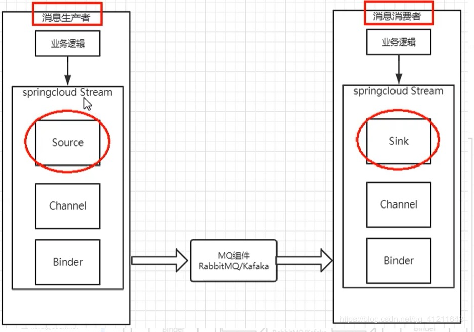

## Stream

消息驱动
屏蔽底层消息中间件的差异，降低切换成本，统一消息的编程模型。

**解决方案**
应用程序通过inputs 或者 outputs 来与SpringCloud Stream中binder对象交互。通过我们配置来binding（绑定），而SpringCloud Stream的binder对象负责与消息中间件交互。
所以，我们只需要搞清楚如何与SpringCloud Stream交互就可以方便使用消息驱动的方式。

通过使用Spring Integration来连接消息代理中间件以实现消息时间驱动
SpringCloud Stream 为一些供应商的消息中间件产品提供了个性化的自动化配置实现，引用了发布-订阅、消费组、分区的三个核心概念。

**Stream标准流程套路**

Binder：很方便的连接中间件，屏蔽差异
Channel：通道，是队列Queue的一种抽象，在消息通讯系统中就是实现存储和转发的媒介，通过Channel对队列进行配置
Source和Sink：简单的可以理解为参照对象是SpringCloud Stream自身，从Stream发布消息就是输出，接收消息就是输入

**编码API和常用注解**

