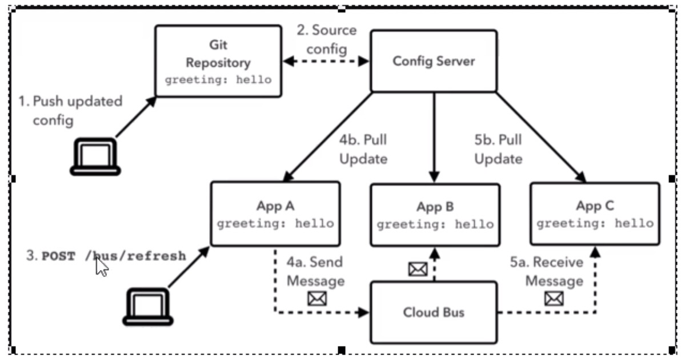

## SpringCloud Config

为微服务架构中的微服务提供集中化的外部配置支持，配置服务器为各个不同微服务应用的所有环境提供一个中心化的外部配置。

## SpringCLoud Bus

消息总线

分布式自动刷新配置。

是用来将分布式系统的节点与轻量级消息系统链接起来的框架。

整合了Java的事件处理机制和消息中间件的功能。

SpringCLoud Bus目前支持RabbitMQ和Kafka

