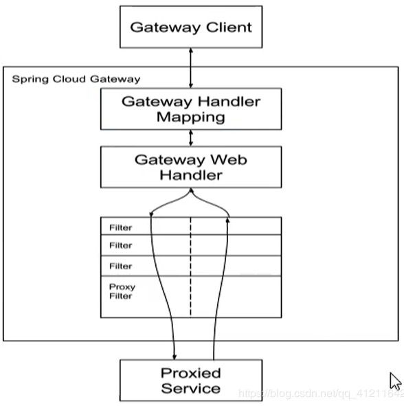

# Gateway

网关(Gateway)又称网间连接器、协议转换器

网关(Gateway)就是一个网络连接到另一个网络的“关口”。

网关在传输层上以实现网络互连，是最复杂的网络互连设备，仅用于两个高层协议不同的网络互连。

网关实质上是一个网络通向其他网络的IP地址。

```text
比如有网络A和网络B，网络A的IP地址范围为“192.168.1.1~192.168.1.254”，子网掩码为255.255.255.0；网络B的IP地址范围为“192.168.2.1~192.168.2.254”，子网掩码为255.255.255.0。

在没有路由器的情况下，两个网络之间是不能进行TCP/IP通信的，即使是两个网络连接在同一台交换机(或集线器)上，TCP/IP协议也会根据子网掩码(255.255.255.0)判定两个网络中的主机处在不同的网络里。

如果网络A中的主机发现数据包的目的主机不在本地网络中，就把数据包转发给它自己的网关，再由网关转发给网络B的网关，网络B的网关再转发给网络B的某个主机。网络B向网络A转发数据包的过程。

对默认网关，其意思是一台主机如果找不到可用的网关，就把数据包发给默认指定的网关，由这个网关来处理数据包。现在主机使用的网关，一般指的是默认网关。所以说，只有设置好网关的IP地址，TCP/IP协议才能实现不同网络之间的相互通信。
```


## Spring Cloud Gateway

基于`Spring5.0+Spring Boot 2.0+Project Reactor`等技术开发的网关，它旨在为微服务架构提供一种简单有效的统一的API理由管路方式。

Spring Cloud Gateway使用的是Webflux中的reactor-netty响应式编程组件，底层使用了Netty通讯框架。

功能：

* 反向代理
* 鉴权
* 流量控制
* 熔断
* 日志监控

**微服务架构中网关的位置**


## 为什么选择Gateway不选Zuul?

* netflix不太靠谱，zuul 2.0一直跳票，迟迟不发布
* SpringCloud Gateway具有如下特性
  基于Spring Framework 5，Project Reactor和Spring Boot 2.0构建
  动态路由：能够匹配任何请求属性
  可以对路由指定 Predicate（断言）和Filter（过滤器）
  集成Hystrix的断路器功能
  集成Spring Cloud 的服务发现功能
  易于编写的Predicate（断言）和Filter（过滤器）
  请求限流功能
  支持路径重写
* SpringCloud Gateway 与 zuul 的区别
  在SpringCloud Finchley 正式版之前，SpringCloud推荐的网关是Netflix提供的Zuul：
  1、Zuul 1.x是一个基于阻塞 I/O 的API Gateway
  2、Zuul 1.x基于servlet 2.5使用阻塞架构它不支持任何长连接（如websocket）Zuul的设计模式和Nginx较像，每次I/O 操作都是从工作线程中选择一个执行，请求线程被阻塞到工作线程完成，但是差别是Nginx用C++实现，Zuul用Java实现，而JVM本身会有一次加载较慢的情况，使得zuul的性能相对较差
  3、Zuul 2.x理念更先进，向基于Netty非阻塞和支持长连接，但SpringCloud目前还没有整合。Zuul 2.x的性能较Zuul 1.x有较大提升。在性能方面，根据官方提供的基准测试，SpringCloud Gateway的RPS（每秒请求数）是Zuul的1.6倍
  4、SpringCloud Gateway建立在Spring Framework5、Project Reactor和Spring Boot 2之上，使用非阻塞API
  5、SpringCloud Gateway还支持WebSocket，并且与Spring紧密集成用于更好的开发体验


## Zuul 1.x模型

SpringCloud中所集成的Zuul版本，采用的是Tomcat容器，使用的是传统的Servlet IO处理模型。

Servlet生命周期？
servlet 由 servlet container 进行生命周期管理
container 启动时构造 servlet 对象并调用 servlet init() 进行初始化；
container 运行时接受请求，并为每个请求分配一个线程（一般从线程池中获取空闲线程）然后调用service()；
container 关闭时调用 servlet destory() 销毁servlet。


**缺点**

servlet是一个简单的网络IO模型，当请求进入servlet container时，servlet container就会为其绑定一个线程，在并发不高的场景下这种模型是适用的。但是一旦高并发（比如用jmeter压测），线程数量就会涨，而线程资源代价是昂贵的（上下文切换，内存消耗大）严重影响请求的处理时间。在一些简单业务场景下，不希望为每个request分配一个线程，只需要1个或几个线程就能应对极大并发的请求，这种业务场景下servlet模型没有优势。


## Gateway 核心概念及工作流程

**核心概念**

* Route(路由)：路由是构建网关的基本模块，它由ID、目标URI，一系列的断言和过滤器组成，如果断言为true则匹配该路由。

* Predicate(断言)：参考的是Java8的java.util.function.Predicate
  开发人员可以匹配HTTP请求中的所有内容(例如请求头或请求参数)，如果请求与断言相匹配则进行路由

* Filter(过滤)：指的是Spring框架中GatewayFilyter的实例，使用过滤器，可以在请求被路由前或者之后进行修改。

**匹配方式就是断言，实现这个匹配方式叫过滤，对外表现出来的就是路由的功能**


**工作流程**



```text
1.客户端向Spring Cloud Gateway发出请求。然后在Gateway Handler Mapping中找到与请求相匹配的路由，将其发送到Gateway Web Handler。

2.Handler再通过指定的过滤器链来将请求发送到我们实际的服务执行业务逻辑，然后返回。
过滤器之间用虚线分开是因为过滤器可能会在发送代理请求之前（“pre”）或之后（“post”）执行业务逻辑。

3.Filter 在 “pre” 类型的过滤器可以做参数校验、权限校验、流量监控、日志输出、协议转换等；在 “post” 类型的过滤器中可以做响应内容、响应头的修改，日志的输出，流量监控等，有着非常重要的作用。
```

**核心逻辑**

路由转发+执行过滤器链

