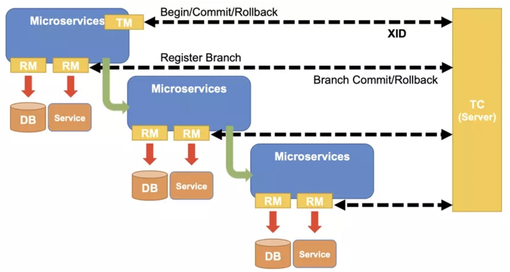
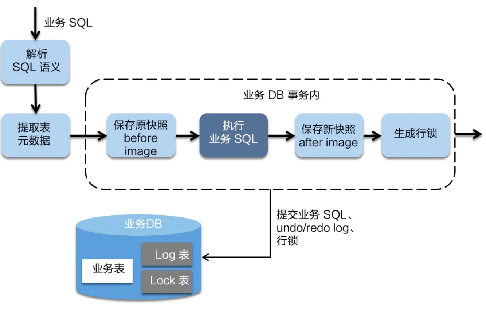
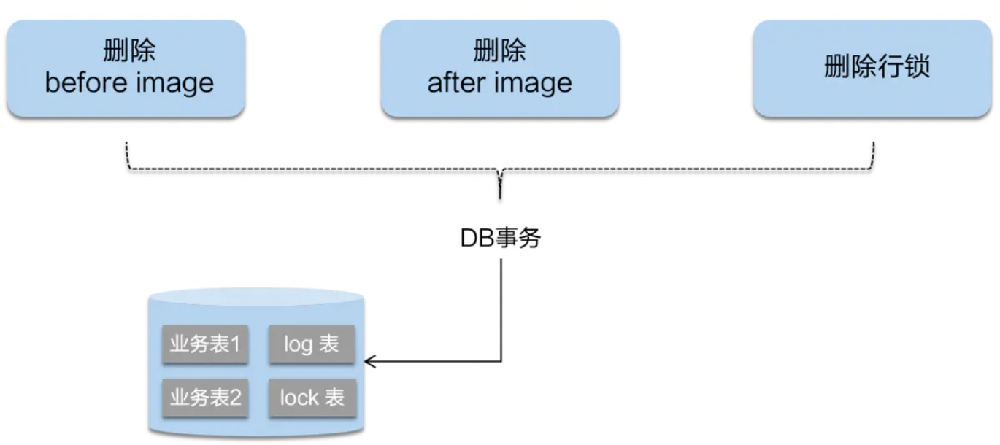
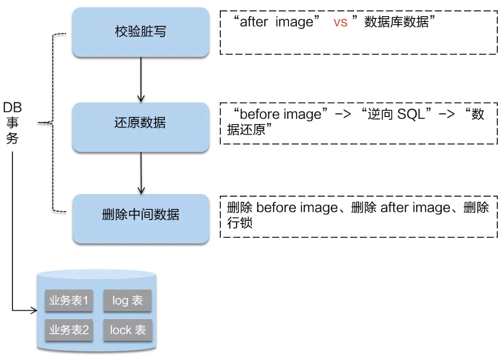

## Seata
分布式事务
[分布式事务](https://juejin.im/post/5b5a0bf9f265da0f6523913b)

Seata 要点：
1 ID + 3组件模型
```text
Transaction ID XID 全局唯一的事务ID
Transaction Coordinator 事务协调器:维护全局和分支事务的状态，驱动全局事务提交或回滚。
Transaction Manager 事务管理器:定义全局事务的范围：开始全局事务、提交或回滚全局事务。
Resource Manager 资源管理器：管理分支事务处理的资源，与TC交谈以注册分支事务和报告分支事务的状态，并驱动分支事务提交或回滚。
```



**执行流程**
* 1.TM 开启分布式事务（TM 向 TC 注册全局事务记录）
* 2.按业务场景，编排数据库、服务等事务内资源（RM 向 TC 汇报资源准备状态 ）
* 3.TM 结束分布式事务，事务一阶段结束（TM 通知 TC 提交/回滚分布式事务）
* 4.TC 汇总事务信息，决定分布式事务是提交还是回滚
* TC 通知所有 RM 提交/回滚 资源，事务二阶段结束


## AT模式介绍

1.一阶段加载



* 1.解析SQL语义，找到"业务SQL"要更新的数据源，在其业务数据更新之前，将其保存成"before image"；

* 2.执行"业务SQL"，更新业务数据；

* 3.在业务更新之后将其保存成"after image"，最后生成行锁。

2.二阶段提交


如果二阶段是顺利提交的话，由于一阶段业务SQL已经更新了数据库，所以只需要将一阶段保存的快照数据和行锁删掉即可，完成数据清理即可。

2.二阶段回滚


二阶段如果是回滚的话，Seata 就需要回滚一阶段已经执行的“业务 SQL”，还原业务数据。
回滚方式便是用“before image”还原业务数据；
但在还原前要首先要校验脏写，对比“数据库当前业务数据”和 “after image”，如果两份数据完全一致就说明没有脏写，可以还原业务数据，
如果不一致就说明有脏写，出现脏写就需要转人工处理。
