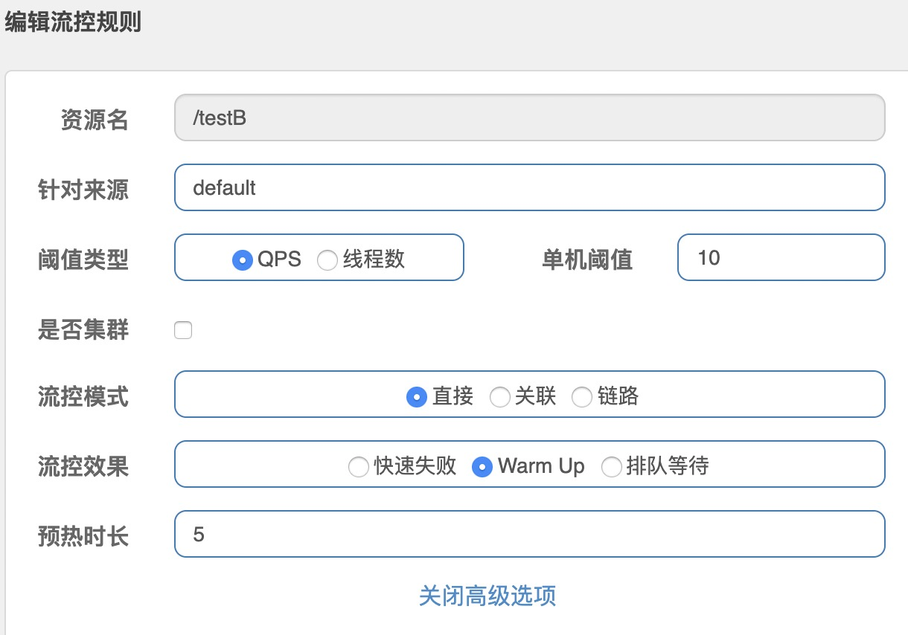
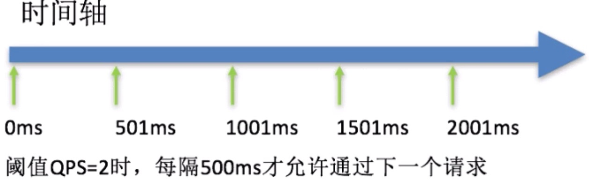
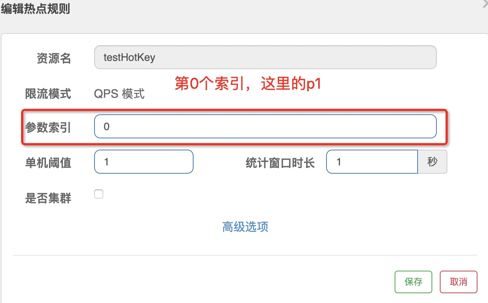

## Sentinel

分布式系统的流量防卫兵

[参考](https://github.com/alibaba/Sentinel/wiki/%E4%BB%8B%E7%BB%8D)

**特征**
* 丰富的应用场景：Sentinel 承接了阿里巴巴近 10 年的双十一大促流量的核心场景，例如秒杀（即突发流量控制在系统容量可以承受的范围）、消息削峰填谷、集群流量控制、实时熔断下游不可用应用等。
* 完备的实时监控：Sentinel 同时提供实时的监控功能。您可以在控制台中看到接入应用的单台机器秒级数据，甚至 500 台以下规模的集群的汇总运行情况。
* 广泛的开源生态：Sentinel 提供开箱即用的与其它开源框架/库的整合模块，例如与 Spring Cloud、Dubbo、gRPC 的整合。您只需要引入相应的依赖并进行简单的配置即可快速地接入 Sentinel。
* 完善的 SPI 扩展点：Sentinel 提供简单易用、完善的 SPI 扩展接口。您可以通过实现扩展接口来快速地定制逻辑。例如定制规则管理、适配动态数据源等。


**组成**
* 核心库（Java 客户端）不依赖任何框架/库，能够运行于所有 Java 运行时环境，同时对 Dubbo / Spring Cloud 等框架也有较好的支持。
`sentinel-core`
* 控制台（Dashboard）基于 Spring Boot 开发，打包后可以直接运行，不需要额外的 Tomcat 等应用容器。
`sentinel-dashboard`

sentinel是懒加载，只有数据进去dashboard才会展示。

## 流控

1.预热
秒杀系统让流量预热，慢慢增加到设置的阈值

sentinel中设置：
 

默认coldFactor为3，即请求QPS从(threshold/3)开始，经多少预热时长才逐渐升至设定的QPS阈值。
例如：
阈值10+预热时长设置5s
系统初始化的阈值为10/3约等于3，即阈值刚开始为3，然后过了5秒后阈值才慢慢升高恢复到10。

2.排队
匀速排队：严格控制请求通过的间隔时间，也即是让请求以均匀的速度通过，对应的是漏桶算法。


这种方式主要用于处理间隔性突发的流量，例如消息队列。例如某一秒有大量的请求到来，
而接下来的几秒则处于空闲状态，我们希望系统能够在接下来的空闲时间逐渐处理这些请求而不是在第一秒直接拒绝多余的请求。


## 降级

[熔断降级](https://github.com/alibaba/Sentinel/wiki/%E7%86%94%E6%96%AD%E9%99%8D%E7%BA%A7)

## 热点参数限流

Sentinel 利用 LRU 策略统计最近最常访问的热点参数，结合令牌桶算法来进行参数级别的流控。热点参数限流支持集群模式。

请求：http://localhost:8401/testHotKey?p1=a
代码：
```java
 @GetMapping("/testHotKey")
    @SentinelResource(value = "testHotKey", blockHandler = "dealTestHotKey") // dealTestHotKey是兜底方法
    public String testHotKey(@RequestParam(value = "p1", required = false) String p1,
                             @RequestParam(value = "p2", required = false) String p2){
//        int age = 10 /0;  
        return "testHotKey -----";
    }

    public String dealTestHotKey(String p1, String p2, BlockException blockException){
        return "dealTestHotKey---------";
    }
```

这样访问QPS为1，会有些请求访问dealTestHotKey方法。

## 持久化
服务重启配置的sentinel流控就会消息，需要对其进行持久化。在nacos中配置：
```json
[
    {
        "resource":"/rateLimit/byUrl", // 资源名称
        "limitApp":"default", // 来源应用
        "grade":1, // 阈值类型，0表示线程数，1表示QPS
        "count":1, // 单机阈值
        "strategy":0, // 流控模式，0表示直接，1表示关联，2表示链路
        "controlBehavior":0, // 流控效果，0表示快速失败，1表示warmup，2表示排队等待
        "clusterMode":false // 是否集群
    }
]
```
